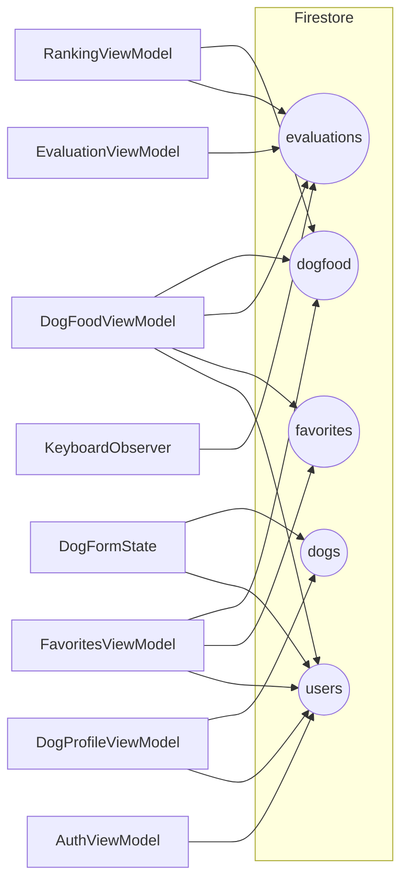

# Architecture Diagrams

WagMeal アプリのアーキテクチャを GitHub 上で可視化するための図をまとめています。  
以下の 3 つの観点で Mermaid 図を表示します。

1. View → ViewModel の依存関係  
2. Firebase を直接触っているファイル一覧  
3. ViewModel → Firestore コレクションの対応関係  

---

## 1. View → ViewModel

```mermaid
flowchart TB
  %% Views
  AllEvaluationsView
  CropAvatarView
  DogAvatarView
  DogCard
  DogDetailView
  DogFoodDetailView
  DogFoodDetailView2
  DogFoodDetailViewPreviewBoot
  DogFoodDetailViewPreviewBoot2
  DogFoodImageView
  DogFormView
  EditDogView
  EvaluationDetailView
  EvaluationInputPreviewWrapper
  EvaluationInputView
  FavoritesView
  HeaderCountRow
  LoginView
  MainHeaderView
  MainTabView
  MyDogPreviewWrapper
  MyDogPreviewWrapperDark
  MyDogView
  NewDogView
  RankingView
  RegisterView
  SearchBarView
  SearchResultsView
  SearchView
  SettingsView
  SplashView
  StarRatingView
  StarStaticView
  StorageImageView
  TermsAgreementView
  TermsTextView
  UserProfileView
  Wrapper
  %% ViewModels
  AuthViewModel:::vm
  DogFoodViewModel:::vm
  DogFormState:::vm
  DogProfileViewModel:::vm
  EvaluationViewModel:::vm
  FavoritesViewModel:::vm
  KeyboardObserver:::vm
  MainTabRouter:::vm
  RankingViewModel:::vm
  StorageImageLoader:::vm
  %% View -> ViewModel
  DogCard --> DogProfileViewModel
  DogDetailView --> MainTabRouter
  DogFoodDetailView --> DogFoodViewModel
  DogFoodDetailView --> MainTabRouter
  DogFoodDetailView2 --> DogFoodViewModel
  DogFoodDetailViewPreviewBoot --> DogFoodViewModel
  DogFoodDetailViewPreviewBoot --> MainTabRouter
  DogFoodDetailViewPreviewBoot2 --> DogFoodViewModel
  DogFormView --> DogProfileViewModel
  EditDogView --> DogProfileViewModel
  FavoritesView --> DogFoodViewModel
  FavoritesView --> DogProfileViewModel
  LoginView --> AuthViewModel
  MainTabView --> AuthViewModel
  MainTabView --> DogFoodViewModel
  MainTabView --> DogProfileViewModel
  MainTabView --> MainTabRouter
  MyDogPreviewWrapper --> AuthViewModel
  MyDogPreviewWrapper --> DogProfileViewModel
  MyDogPreviewWrapperDark --> AuthViewModel
  MyDogPreviewWrapperDark --> DogProfileViewModel
  MyDogView --> AuthViewModel
  MyDogView --> DogProfileViewModel
  NewDogView --> DogProfileViewModel
  RankingView --> DogFoodViewModel
  RankingView --> DogProfileViewModel
  RegisterView --> AuthViewModel
  SearchResultsView --> DogFoodViewModel
  SearchView --> DogFoodViewModel
  SearchView --> DogProfileViewModel
  SettingsView --> AuthViewModel
  TermsAgreementView --> AuthViewModel
  UserProfileView --> AuthViewModel
  Wrapper --> DogFoodViewModel
  Wrapper --> DogProfileViewModel
  classDef vm fill:#eef,stroke:#88f;
```

---

## 2. Firebase を直接触っているファイル

---

## 3. ViewModel → Firestore Collections

---
